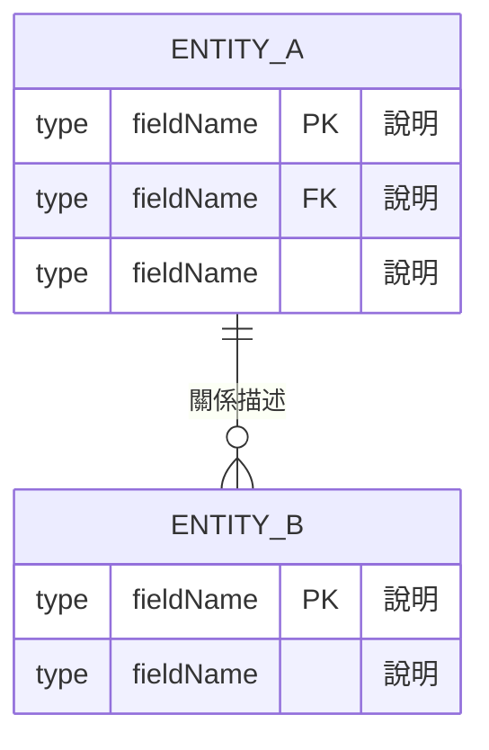

# 資料模型設計技能（Data Model Design Skill）

## Overview

此技能指導 AI agent 協助使用者根據 PRD 與架構設計文件，產出系統所需的**完整資料模型定義**。資料模型是銜接架構設計與實作開發的關鍵橋樑，明確定義系統中各資料實體的結構、型別、約束與關聯，讓前後端工程師對「資料長什麼樣」達成共識。

## Trigger Conditions & Usage

- **Use when:** 使用者說「幫我設計資料模型」、「定義 JSON 格式」、「畫 ER 圖」、「定義欄位」、「設計資料庫 Schema」、「設計 localStorage 格式」等。
- **Goal:** 產出結構清晰、有型別與驗證規則的資料模型定義文件，可直接供工程師實作使用。

## Instructions

依照以下步驟引導使用者完成資料模型設計：

### 步驟一：釐清資料來源與儲存策略

在設計資料模型前，先確認以下資訊：

1. **資料從哪裡來？**（使用者輸入 / 靜態檔案 / 外部 API / 資料庫）
2. **資料存在哪？**（localStorage / JSON 檔案 / 關聯式資料庫 / NoSQL / 記憶體快取）
3. **資料的生命週期？**（永久保存 / 會話結束即清除 / 有效期限）
4. **資料的讀寫頻率？**（唯讀 / 頻繁讀寫 / 批次更新）

### 步驟二：識別核心實體（Entities）

從 PRD 的功能需求中萃取核心資料實體：

- 找出**名詞**作為候選實體（例如：用戶、籤詩、紀錄、類別）
- 定義每個實體的**主鍵（Primary Key）**
- 識別實體之間的**關聯**（一對一、一對多、多對多）

### 步驟三：繪製 ER 圖

使用 Mermaid `erDiagram` 語法繪製實體關係圖：



**關係符號說明：**
- `||--||`：一對一（One-to-One）
- `||--o{`：一對多（One-to-Many）
- `}o--o{`：多對多（Many-to-Many）
- `o`：零個或多個；`|`：恰好一個

### 步驟四：定義欄位規格

針對每個實體，逐一定義欄位的完整規格：

| 欄位名稱 | 型別 | 必填 | 預設值 | 驗證規則 | 說明 |
|---------|------|------|--------|---------|------|
| `id` | `string` | ✅ | — | UUID v4 格式 | 唯一識別碼 |
| `grade` | `enum` | ✅ | — | `上上\|上\|中\|下\|下下` | 籤詩等級 |
| `created_at` | `datetime` | ✅ | `now()` | ISO 8601 格式 | 建立時間 |

**常用型別對照：**
- `string`：文字（需定義最大長度）
- `number`：數字（需區分 integer / float）
- `boolean`：布林值
- `enum`：枚舉（需列出所有合法值）
- `datetime`：日期時間（建議使用 ISO 8601）
- `array<T>`：陣列（需定義元素型別）
- `object`：巢狀物件（需展開定義子欄位）

### 步驟五：撰寫 JSON Schema

依據欄位規格，產出標準 JSON Schema（Draft 7）格式：

```json
{
  "$schema": "http://json-schema.org/draft-07/schema#",
  "$id": "https://example.com/schemas/entity.json",
  "title": "EntityName",
  "description": "實體說明",
  "type": "object",
  "required": ["id", "field1"],
  "properties": {
    "id": {
      "type": "string",
      "pattern": "^[0-9a-f]{8}-[0-9a-f]{4}-4[0-9a-f]{3}-[89ab][0-9a-f]{3}-[0-9a-f]{12}$",
      "description": "UUID v4 格式識別碼"
    },
    "grade": {
      "type": "string",
      "enum": ["上上", "上", "中", "下", "下下"],
      "description": "籤詩等級"
    }
  },
  "additionalProperties": false
}
```

### 步驟六：提供範例資料（Mock Data）

為每個實體提供至少 2–3 筆符合 Schema 的範例資料，供工程師開發與測試使用：

```json
[
  {
    "id": "550e8400-e29b-41d4-a716-446655440000",
    "grade": "上上",
    "created_at": "2026-04-22T09:00:00+08:00"
  }
]
```

### 步驟七：定義資料驗證規則

列出業務層面的驗證規則（超出 JSON Schema 的邏輯約束）：

- **必填驗證**：哪些欄位不可為空字串 `""`（不只是 `null`）
- **範圍驗證**：數值的最小值（`minimum`）與最大值（`maximum`）
- **格式驗證**：正則表達式、日期格式、URL 格式
- **跨欄位驗證**：如 `end_date` 必須晚於 `start_date`
- **唯一性驗證**：哪些欄位值在集合中必須唯一

### 步驟八：儲存策略與索引設計

說明資料如何被存取與索引：

- **查詢模式**：最常見的查詢是哪些？（例如：依 `category` 篩選籤詩）
- **索引欄位**：哪些欄位需要建立索引以加速查詢？
- **localStorage 結構**（若適用）：
  ```
  localStorage key: "fortune_history"
  localStorage value: JSON.stringify(HistoryRecord[])  // 最多 10 筆
  ```

## 輸出格式規範

完成的資料模型文件應包含以下部分，輸出為 Markdown 格式，儲存至 `docs/DATA_MODEL.md`：

```markdown
# 資料模型定義文件

## 1. 實體清單總覽
## 2. ER 圖（Mermaid erDiagram）
## 3. 實體詳細定義
   ### 3.x [EntityName]
   - 欄位規格表
   - JSON Schema
   - 範例資料
## 4. 資料驗證規則
## 5. 儲存策略與索引
## 6. 資料流說明
```

## Constraints & Guardrails

- **ER 圖為強制項目**：每份資料模型文件必須包含 Mermaid `erDiagram`。
- **JSON Schema 必須合法**：產出的 Schema 必須符合 JSON Schema Draft 7 規範，所有 `required` 欄位必須在 `properties` 中定義。
- **型別不可模糊**：禁止使用「字串或數字」等模糊描述，每個欄位只能有一個明確型別（`anyOf` 除外，需說明理由）。
- **枚舉值必須窮舉**：`enum` 型別必須列出所有合法值，並說明未來擴充策略。
- **範例資料必須合法**：提供的 Mock Data 必須能通過自身的 JSON Schema 驗證。
- **不涉及實作細節**：資料模型文件只定義「資料的形狀」，不包含 ORM 程式碼、SQL DDL 或具體實作語言的型別宣告（這屬於 TDD 範疇）。
- **命名一致性**：欄位命名統一使用 `snake_case`（JSON）或 `camelCase`（JavaScript），需在文件開頭聲明並全文一致。

## 命名慣例參考

| 情境 | 慣例 | 範例 |
|------|------|------|
| JSON 欄位名稱 | `snake_case` | `fortune_id`, `created_at` |
| JavaScript 變數 | `camelCase` | `fortuneId`, `createdAt` |
| 實體名稱（ER 圖） | `UPPER_SNAKE_CASE` | `FORTUNE`, `HISTORY_RECORD` |
| 枚舉值 | 中文或英文大寫 | `上上`, `LOVE`, `CAREER` |

## References

- [JSON Schema Draft 7 規範](https://json-schema.org/specification-links.html#draft-7)
- [Mermaid ER Diagram 語法](https://mermaid.js.org/syntax/entityRelationshipDiagram.html)
- [ISO 8601 日期時間格式](https://www.iso.org/iso-8601-date-and-time-format.html)
- [資料模型範本](./assets/data-model-template.md)（待建立）
