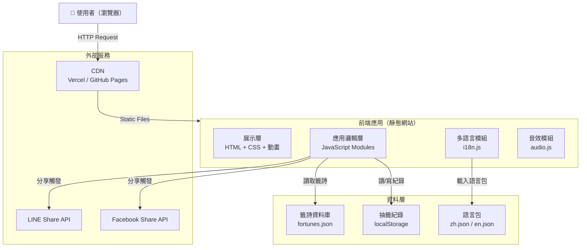
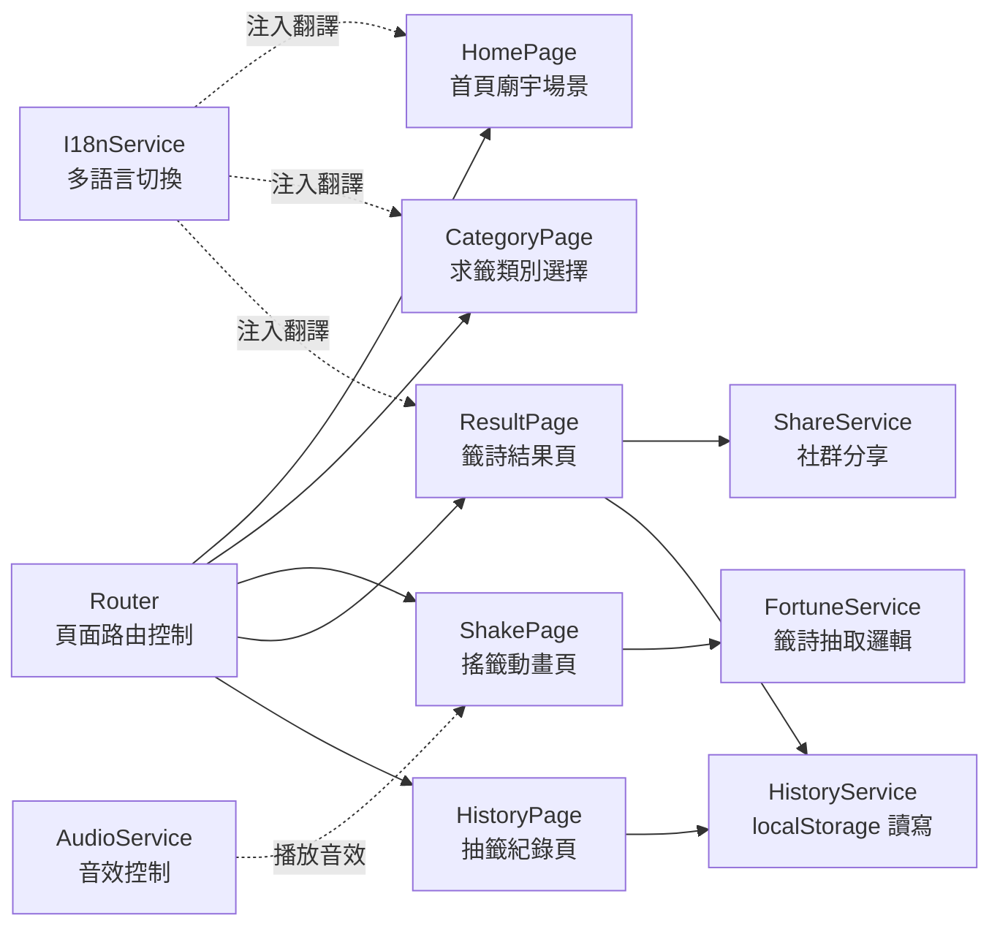
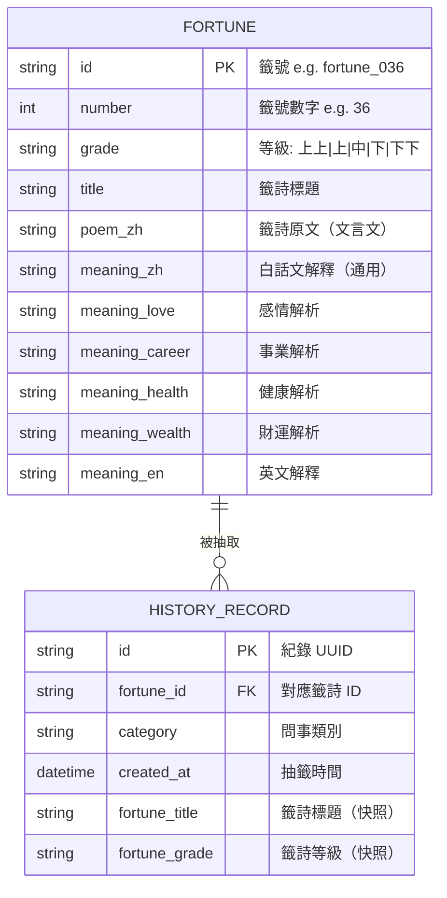
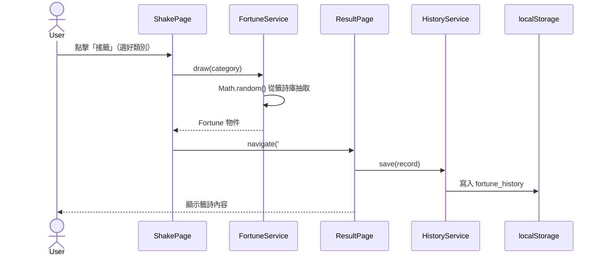
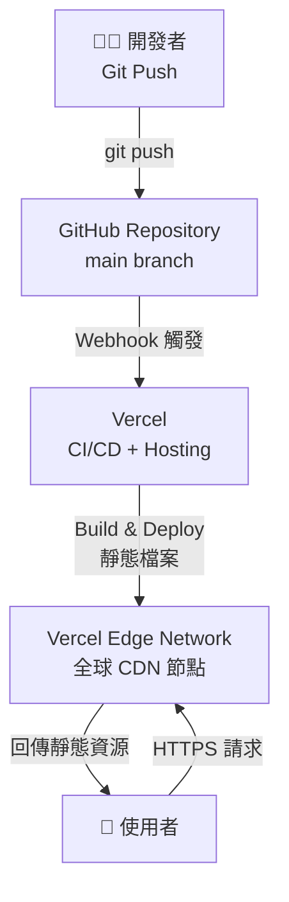

# 系統架構設計文件（Architecture Design Document）
## 公廟線上抽運勢籤網站

---

## 1. 文件基本資訊（Document Metadata）

| 欄位 | 內容 |
|------|------|
| **文件標題** | 公廟線上抽運勢籤網站 - 系統架構設計 |
| **版本號** | v1.0 |
| **作者 / 負責人** | *(待填寫)* |
| **建立日期** | 2026-04-22 |
| **更新日期** | 2026-04-22 |
| **審核人員** | 技術主管、資深前端工程師 |
| **關聯文件** | [PRD.md](./PRD.md) |

---

## 2. 架構概覽（Architecture Overview）

### 系統簡介

本系統為一個純前端靜態網站，提供台灣公廟文化風格的線上虛擬抽籤體驗。用戶可選擇問事類別、透過搖籤動畫抽取籤詩、閱讀白話文解釋，並將結果分享至社群媒體。系統無需後端伺服器，所有資料與邏輯均在瀏覽器端執行。

### 架構風格

採用 **單頁應用（SPA）+ 靜態資源分發** 的分層前端架構：

- **展示層（Presentation Layer）**：HTML + CSS，負責 UI 渲染與動畫
- **應用邏輯層（Application Layer）**：Vanilla JavaScript，負責流程控制、狀態管理、多語言
- **資料層（Data Layer）**：JSON 靜態檔案（籤詩庫）+ localStorage（抽籤紀錄）
- **基礎設施層（Infrastructure Layer）**：CDN 靜態部署（Vercel / GitHub Pages）

### 高階架構圖



---

## 3. 技術選型（Technology Stack）

| 層次 | 技術選擇 | 選擇理由 |
|------|---------|---------|
| **前端結構** | HTML5 | 語意化標籤確保 SEO 與無障礙性；無框架依賴，降低維護成本 |
| **前端樣式** | Vanilla CSS + CSS Animation | 純 CSS 動畫效能優於 JS 驅動；無需打包工具，部署簡單 |
| **前端邏輯** | Vanilla JavaScript (ES6+) | 無框架依賴，減少 bundle size；目標用戶含中高齡族群，需穩定相容性 |
| **字型** | Google Fonts（Noto Serif TC） | 支援繁體中文毛筆風格；CDN 提供快取，載入效能佳 |
| **資料格式** | JSON | 人類可讀、易於擴充；可直接 `fetch()` 載入，無需資料庫 |
| **本地儲存** | localStorage | 免登入即可保存抽籤紀錄；容量 5MB 足夠儲存 10 筆紀錄 |
| **動畫** | CSS Keyframes + Web Animations API | 硬體加速，確保動畫幀率 ≥ 30 FPS |
| **音效** | Web Audio API / HTML `<audio>` | 原生瀏覽器支援，無需第三方套件 |
| **部署平台** | Vercel（主）/ GitHub Pages（備） | 免費方案即提供 HTTPS + 全球 CDN；Vercel 部署更新流程最簡便 |
| **版本控制** | Git + GitHub | 業界標準；與 Vercel 整合自動部署 |

---

## 4. 系統元件設計（Component Design）

### 元件關係圖



### 各元件說明

#### Router（頁面路由）
- **職責**：以 Hash-based routing（`#home`, `#category`, `#shake`, `#result`, `#history`）控制單頁應用頁面切換
- **介面**：`navigate(page, params?)` 方法
- **依賴**：無

#### FortuneService（籤詩服務）
- **職責**：從 `fortunes.json` 載入資料，依類別隨機抽取一支籤
- **介面**：`draw(category): Fortune`、`getAll(): Fortune[]`
- **依賴**：`fortunes.json`
- **資料流**：ShakePage 呼叫 `draw(category)` → 回傳 Fortune 物件 → 傳遞至 ResultPage

#### HistoryService（紀錄服務）
- **職責**：管理 localStorage 中的抽籤歷史，最多保留 10 筆
- **介面**：`save(record)`, `getAll(): Record[]`, `clear()`
- **依賴**：localStorage

#### ShareService（分享服務）
- **職責**：產生分享連結並呼叫 LINE / Facebook Share API
- **介面**：`shareToLine(fortune)`, `shareToFacebook(fortune)`, `copyLink(fortune)`
- **依賴**：LINE Share URL Scheme、Facebook Share API

#### I18nService（多語言服務）
- **職責**：載入語言包、提供翻譯函式、監聽語言切換事件
- **介面**：`t(key): string`、`setLang(lang: 'zh'|'en')`
- **依賴**：`locales/zh.json`、`locales/en.json`

#### AudioService（音效服務）
- **職責**：播放搖籤音效、控制靜音狀態
- **介面**：`play(soundId)`, `toggleMute()`
- **依賴**：`assets/audio/*.mp3`

---

## 5. 資料架構（Data Architecture）

### 核心資料模型



### 資料儲存策略

| 資料類型 | 儲存位置 | 格式 | 說明 |
|---------|---------|------|------|
| 籤詩資料庫（60 支） | 靜態 JSON 檔案 | `fortunes.json` | 隨網站部署，`fetch()` 載入後快取於記憶體 |
| 語言包 | 靜態 JSON 檔案 | `locales/zh.json`, `locales/en.json` | 按需載入，切換語言時 fetch |
| 抽籤紀錄（最多 10 筆） | localStorage | JSON 字串 | key: `fortune_history`，超出上限自動移除最舊紀錄 |
| 語言偏好 | localStorage | 字串 | key: `fortune_lang`，值: `"zh"` 或 `"en"` |
| 靜音設定 | localStorage | 布林值 | key: `fortune_muted` |

### `fortunes.json` 結構範例

```json
{
  "fortunes": [
    {
      "id": "fortune_001",
      "number": 1,
      "grade": "上上",
      "title": "第一籤 上上 乾為天",
      "poem_zh": "天行健，君子以自強不息。",
      "meaning_zh": "諸事順遂，大吉之兆。",
      "meaning_love": "感情穩固，宜主動表達心意。",
      "meaning_career": "事業鴻圖大展，把握當前機遇。",
      "meaning_health": "身體康健，注意規律作息。",
      "meaning_wealth": "財運亨通，可考慮穩健投資。",
      "meaning_en": "All affairs proceed smoothly. An auspicious sign."
    }
  ]
}
```

### 資料流向圖



---

## 6. API 設計（API Design）

本系統為純前端靜態網站，**不設計後端 REST API**。所有「API」均為靜態 JSON 資源的 fetch 請求。

### 靜態資源端點

| 方法 | 路徑 | 描述 | 回應格式 |
|------|------|------|---------|
| GET | `/data/fortunes.json` | 取得完整籤詩資料庫 | `{ fortunes: Fortune[] }` |
| GET | `/locales/zh.json` | 取得繁體中文語言包 | `{ key: string }` |
| GET | `/locales/en.json` | 取得英文語言包 | `{ key: string }` |

### 社群分享 URL 格式

| 服務 | URL 格式 |
|------|---------|
| LINE | `https://social-plugins.line.me/lineit/share?url={encodedURL}&text={encodedText}` |
| Facebook | `https://www.facebook.com/sharer/sharer.php?u={encodedURL}` |
| 複製連結 | `navigator.clipboard.writeText(shareURL)` |

### 分享內容格式

```
【{廟名}運勢籤】
我抽到了「{籤號} {等級}」
{籤詩標題}
{白話摘要（前 40 字）}
➡ {網站 URL}
```

---

## 7. 安全性設計（Security Design）

### 身份驗證

無需用戶登入，系統不蒐集任何個人識別資料（PII）。

### 資料保護

| 面向 | 措施 |
|------|------|
| **傳輸加密** | 部署於 Vercel/GitHub Pages，強制 HTTPS |
| **localStorage 資料** | 僅儲存非敏感資料（籤號、時間戳），無需加密 |
| **第三方分享** | 分享連結僅包含籤詩摘要，不傳遞任何用戶資料 |

### 前端防護措施

- **XSS 防禦**：所有動態插入 DOM 的內容使用 `textContent` 而非 `innerHTML`；籤詩內容來自受控 JSON，無用戶輸入直接渲染
- **CSRF**：純靜態網站無後端狀態操作，CSRF 風險不適用
- **Content Security Policy（CSP）**：設定 HTTP Header 限制外部資源來源（僅允許 Google Fonts、LINE/FB 域名）
- **Device Motion API**：需向用戶說明用途並取得授權，拒絕時降級為點擊觸發

---

## 8. 部署架構（Deployment Architecture）

### 環境規劃

| 環境 | 用途 | 部署方式 |
|------|------|---------|
| **Development** | 本機開發與測試 | `npx serve .` 或 VS Code Live Server |
| **Staging** | PR 預覽、功能驗收 | Vercel Preview Deployment（自動） |
| **Production** | 正式對外服務 | Vercel Production（main branch 合併後自動觸發） |

### 基礎設施圖



### 專案目錄結構

```
/
├── index.html          # 單頁應用入口
├── css/
│   ├── main.css        # 主樣式
│   ├── animations.css  # 動畫樣式
│   └── theme.css       # 廟宇主題顏色變數
├── js/
│   ├── app.js          # 主程式進入點
│   ├── router.js       # Hash Router
│   ├── fortune.js      # FortuneService
│   ├── history.js      # HistoryService
│   ├── share.js        # ShareService
│   ├── i18n.js         # I18nService
│   └── audio.js        # AudioService
├── data/
│   └── fortunes.json   # 籤詩資料庫（60 支）
├── locales/
│   ├── zh.json         # 繁體中文語言包
│   └── en.json         # 英文語言包
├── assets/
│   ├── audio/          # 音效檔（mp3）
│   └── images/         # 圖示、背景圖
└── docs/
    ├── PRD.md
    └── ARCHITECTURE.md
```

### 擴展策略

目前為純靜態網站，無需水平擴展，CDN 天然支援高並發。若未來需要後端（如用戶帳號、廟宇後台），擴展路徑為：

```
靜態網站 → Vercel Serverless Functions（API Routes）→ 獨立後端服務（Node.js）
```

---

## 9. 非功能性考量（Non-Functional Considerations）

| 面向 | 設計決策 |
|------|---------|
| **效能** | 首次載入：`fortunes.json` 以 `fetch()` 非同步載入並快取至 `window.fortuneCache`；圖片使用 WebP 格式；字型以 `font-display: swap` 避免 FOIT |
| **可靠性** | 純靜態網站無伺服器故障點；Vercel CDN 多節點備援；`fortunes.json` 載入失敗時顯示友善錯誤提示並提供重試按鈕 |
| **可觀測性** | 整合 Google Analytics 4 追蹤頁面瀏覽與抽籤事件；使用 `console.error` 記錄前端錯誤（後期可接 Sentry） |
| **可維護性** | 程式碼分層為獨立 JS 模組（Service 模式）；籤詩內容與程式碼分離（JSON 檔案），非工程師可直接編輯 |
| **可測試性** | 各 Service 模組設計為純函式，方便單元測試；使用 Playwright 進行端對端測試（E2E） |
| **無障礙性** | 所有互動元素具備 `aria-label`；動畫提供 `prefers-reduced-motion` media query 支援；色彩對比符合 WCAG AA |

---

## 10. 架構決策紀錄（Architecture Decision Records, ADR）

### ADR-001：採用純前端靜態網站，不建置後端伺服器

- **背景**：PRD 指出系統需快速上線，且籤詩資料量小、無需用戶登入
- **決策**：全站採用靜態 HTML/CSS/JS，部署至 Vercel CDN
- **理由**：
  - 無伺服器運維成本，降低技術門檻
  - CDN 部署天然具備高可用性（99.9%+）
  - 免費方案即可支撐 MVP 流量需求
- **後果**：❌ 無法實現雲端同步紀錄；✅ 開發速度快、維運成本低

### ADR-002：使用 localStorage 儲存抽籤紀錄，不使用雲端資料庫

- **背景**：PRD 要求保存最近 10 筆抽籤紀錄，且不蒐集用戶個人資料
- **決策**：使用瀏覽器 localStorage，key 為 `fortune_history`
- **理由**：
  - 零後端依賴，符合靜態網站架構
  - 不涉及個人資料，無隱私合規疑慮
  - 10 筆紀錄資料量遠低於 5MB 限制
- **後果**：❌ 換裝置或清除瀏覽器資料後紀錄消失；✅ 無隱私風險，實作簡單

### ADR-003：使用 Vanilla JavaScript，不採用 React/Vue 等框架

- **背景**：系統功能相對獨立，頁面狀態較簡單；目標用戶含中高齡族群，需要廣泛的瀏覽器相容性
- **決策**：使用 ES6+ 原生 JavaScript 搭配 Module 模式
- **理由**：
  - 無框架 bundle 開銷，首屏載入更快
  - 無版本升級維護負擔
  - Hash Router 足以實現 SPA 頁面切換
  - 開發者無需學習特定框架即可貢獻
- **後果**：❌ 複雜狀態管理需自行實作；✅ bundle size 最小、相容性最佳

### ADR-004：籤詩資料以 JSON 靜態檔案管理，不使用資料庫

- **背景**：60 支籤詩為固定資料，更新頻率極低
- **決策**：所有籤詩存於 `data/fortunes.json`，隨網站部署
- **理由**：
  - 非工程師（如廟方人員）可直接編輯 JSON 新增籤詩
  - `fetch()` 載入後快取於記憶體，後續存取無網路開銷
  - 無需資料庫授權費用與維運成本
- **後果**：❌ 更新籤詩需重新部署；✅ 零運維成本、開發極為簡便

---

## 11. 開放問題（Open Questions）

| # | 問題 | 影響範圍 | 截止日 |
|---|------|---------|--------|
| OQ-1 | Device Motion API 在 iOS 13+ 需要用戶主動授權，授權引導 UI 如何設計？若拒絕授權，降級為點擊觸發的體驗差異是否可接受？ | ShakePage、AudioService | TBD |
| OQ-2 | 籤詩版權確認後，`fortunes.json` 的資料應由誰負責撰寫與審核？是否需要制定 JSON Schema 避免格式錯誤？ | FortuneService、資料架構 | TBD |
| OQ-3 | 隨機演算法是否需要加權（同日不重複出現下下籤）？若是，需在 FortuneService 中實作日期種子隨機邏輯 | FortuneService | TBD |
| OQ-4 | Google Analytics 4 的 Measurement ID 是否已申請？追蹤事件的命名規範為何？ | 可觀測性 | TBD |
| OQ-5 | Phase 3 規劃新增廟宇選擇功能，`fortunes.json` 的資料結構是否需要在 v1.0 即預留 `temple_id` 欄位以便後續擴充？ | 資料架構 | Week 2 前確認 |
