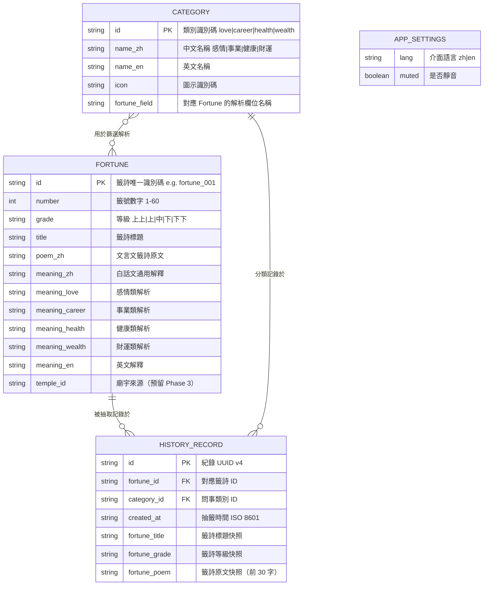
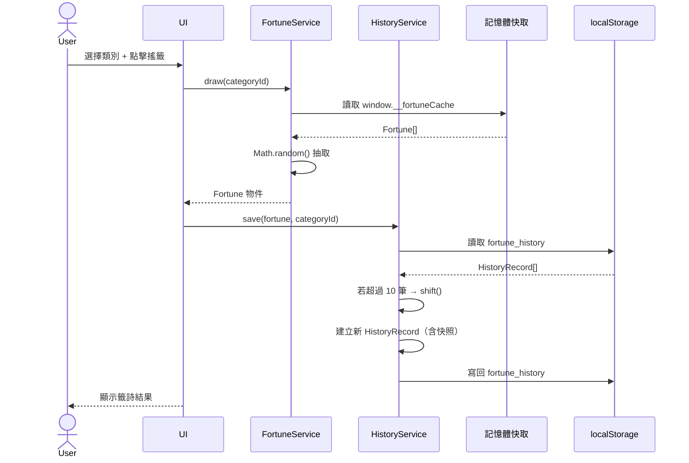

# 資料模型定義文件（Data Model Document）
## 公廟線上抽運勢籤網站

> **命名慣例**：JSON 欄位使用 `snake_case`；實體名稱使用 `UPPER_SNAKE_CASE`；枚舉值使用中文原文。
> **關聯文件**：[PRD.md](./PRD.md) | [ARCHITECTURE.md](./ARCHITECTURE.md)

---

## 1. 實體清單總覽

| 實體名稱 | 儲存位置 | 說明 | 讀寫模式 |
|---------|---------|------|---------|
| `FORTUNE` | `data/fortunes.json` | 籤詩資料庫，60 支籤 | 唯讀（部署時固定） |
| `CATEGORY` | 內嵌於 `fortunes.json` | 問事類別定義 | 唯讀 |
| `HISTORY_RECORD` | `localStorage` | 用戶抽籤歷史，最多 10 筆 | 讀寫 |
| `APP_SETTINGS` | `localStorage` | 語言偏好與音效設定 | 讀寫 |
| `I18N_ENTRY` | `locales/zh.json`, `locales/en.json` | 多語言文字對應表 | 唯讀 |

---

## 2. ER 圖



---

## 3. 實體詳細定義

### 3.1 FORTUNE（籤詩）

**資料來源**：`data/fortunes.json`，部署時固定，`fetch()` 載入後快取記憶體。

#### 欄位規格

| 欄位名稱 | 型別 | 必填 | 最大長度 | 驗證規則 | 說明 |
|---------|------|------|---------|---------|------|
| `id` | `string` | ✅ | 20 | 格式 `fortune_XXX`，XXX 為 3 位數字 | 唯一識別碼 |
| `number` | `integer` | ✅ | — | 1 ≤ number ≤ 60，全集合唯一 | 籤號 |
| `grade` | `enum` | ✅ | — | `上上\|上\|中\|下\|下下` | 籤詩等級 |
| `title` | `string` | ✅ | 30 | 不可空字串 | 籤詩標題 |
| `poem_zh` | `string` | ✅ | 200 | 不可空字串 | 文言文籤詩原文 |
| `meaning_zh` | `string` | ✅ | 300 | 不可空字串 | 白話文通用解釋 |
| `meaning_love` | `string` | ✅ | 200 | 不可空字串 | 感情類解析 |
| `meaning_career` | `string` | ✅ | 200 | 不可空字串 | 事業類解析 |
| `meaning_health` | `string` | ✅ | 200 | 不可空字串 | 健康類解析 |
| `meaning_wealth` | `string` | ✅ | 200 | 不可空字串 | 財運類解析 |
| `meaning_en` | `string` | ✅ | 400 | 不可空字串 | 英文解釋 |
| `temple_id` | `string` | ❌ | 20 | 預留欄位，Phase 3 使用 | 廟宇來源 |

#### JSON Schema

```json
{
  "$schema": "http://json-schema.org/draft-07/schema#",
  "$id": "fortune.schema.json",
  "title": "Fortune",
  "description": "單支籤詩資料結構",
  "type": "object",
  "required": ["id", "number", "grade", "title", "poem_zh", "meaning_zh",
               "meaning_love", "meaning_career", "meaning_health", "meaning_wealth", "meaning_en"],
  "properties": {
    "id": {
      "type": "string",
      "pattern": "^fortune_\\d{3}$",
      "description": "籤詩唯一識別碼，格式 fortune_001"
    },
    "number": {
      "type": "integer",
      "minimum": 1,
      "maximum": 60,
      "description": "籤號數字"
    },
    "grade": {
      "type": "string",
      "enum": ["上上", "上", "中", "下", "下下"],
      "description": "籤詩等級"
    },
    "title": {
      "type": "string",
      "minLength": 1,
      "maxLength": 30,
      "description": "籤詩標題"
    },
    "poem_zh": {
      "type": "string",
      "minLength": 1,
      "maxLength": 200,
      "description": "文言文籤詩原文"
    },
    "meaning_zh": { "type": "string", "minLength": 1, "maxLength": 300 },
    "meaning_love": { "type": "string", "minLength": 1, "maxLength": 200 },
    "meaning_career": { "type": "string", "minLength": 1, "maxLength": 200 },
    "meaning_health": { "type": "string", "minLength": 1, "maxLength": 200 },
    "meaning_wealth": { "type": "string", "minLength": 1, "maxLength": 200 },
    "meaning_en": { "type": "string", "minLength": 1, "maxLength": 400 },
    "temple_id": {
      "type": "string",
      "maxLength": 20,
      "description": "廟宇來源識別碼（Phase 3 預留欄位）"
    }
  },
  "additionalProperties": false
}
```

#### `fortunes.json` 頂層結構

```json
{
  "$schema": "./fortunes.schema.json",
  "version": "1.0.0",
  "total": 60,
  "fortunes": [ ]
}
```

#### 範例資料

```json
[
  {
    "id": "fortune_001",
    "number": 1,
    "grade": "上上",
    "title": "第一籤 上上 乾為天",
    "poem_zh": "天行健，君子以自強不息。龍飛九天，萬象更新。",
    "meaning_zh": "諸事順遂，大吉之兆。把握良機，勇往直前。",
    "meaning_love": "感情穩固，緣份深厚，宜主動表達心意，佳偶天成。",
    "meaning_career": "事業鴻圖大展，貴人相助，把握當前機遇，必有斬獲。",
    "meaning_health": "身體康健，精力充沛，注意規律作息，保持運動習慣。",
    "meaning_wealth": "財運亨通，正財偏財皆宜，可考慮穩健投資，收益可期。",
    "meaning_en": "All affairs proceed smoothly. An auspicious sign. Seize opportunities and move forward with confidence."
  },
  {
    "id": "fortune_030",
    "number": 30,
    "grade": "中",
    "title": "第三十籤 中 水火既濟",
    "poem_zh": "陰陽調和，水火相濟。守成待機，中道而行。",
    "meaning_zh": "平順之象，不宜躁進，守成待時，靜待良機。",
    "meaning_love": "感情平穩，需多溝通理解，避免衝動行事，緣份尚需培養。",
    "meaning_career": "現況穩定，宜鞏固基礎，暫勿輕易冒進，靜待時機成熟。",
    "meaning_health": "健康平穩，注意飲食均衡，避免過度勞累，定期健康檢查。",
    "meaning_wealth": "財運平平，守成為宜，避免高風險投資，量入為出。",
    "meaning_en": "A balanced sign. Maintain stability and wait for the right moment. Avoid impulsive decisions."
  },
  {
    "id": "fortune_060",
    "number": 60,
    "grade": "下下",
    "title": "第六十籤 下下 山地剝",
    "poem_zh": "剝落之象，諸事不順。忍耐待時，靜極生動。",
    "meaning_zh": "時運不濟，宜謹慎保守，靜待時機轉換，切勿強行而為。",
    "meaning_love": "感情受阻，雙方需冷靜思考，暫緩重大決定，多給彼此空間。",
    "meaning_career": "事業遇阻，暫避鋒芒，蓄積實力，待時機成熟再行動。",
    "meaning_health": "身體較虛弱，需多休養，避免過度操勞，注意慢性病調理。",
    "meaning_wealth": "財運欠佳，嚴禁投機，守住本金為要，靜待財運回升。",
    "meaning_en": "An unfavorable sign. Exercise caution and patience. Wait for circumstances to improve before taking action."
  }
]
```

---

### 3.2 CATEGORY（問事類別）

**資料來源**：內嵌於應用程式碼或獨立 `data/categories.json`。

#### 欄位規格

| 欄位名稱 | 型別 | 必填 | 驗證規則 | 說明 |
|---------|------|------|---------|------|
| `id` | `enum` | ✅ | `love\|career\|health\|wealth` | 類別識別碼 |
| `name_zh` | `string` | ✅ | 不可空字串 | 中文名稱 |
| `name_en` | `string` | ✅ | 不可空字串 | 英文名稱 |
| `icon` | `string` | ✅ | 合法 emoji 或圖示 ID | 類別圖示 |
| `fortune_field` | `string` | ✅ | 必須對應 Fortune 的欄位名稱 | 對應解析欄位 |

#### 範例資料

```json
[
  { "id": "love",   "name_zh": "感情", "name_en": "Love & Relationship", "icon": "❤️", "fortune_field": "meaning_love" },
  { "id": "career", "name_zh": "事業", "name_en": "Career & Work",       "icon": "💼", "fortune_field": "meaning_career" },
  { "id": "health", "name_zh": "健康", "name_en": "Health & Wellness",   "icon": "🌿", "fortune_field": "meaning_health" },
  { "id": "wealth", "name_zh": "財運", "name_en": "Wealth & Finance",    "icon": "💰", "fortune_field": "meaning_wealth" }
]
```

---

### 3.3 HISTORY_RECORD（抽籤紀錄）

**資料來源**：用戶抽籤後由 `HistoryService` 寫入 `localStorage`。

#### 欄位規格

| 欄位名稱 | 型別 | 必填 | 驗證規則 | 說明 |
|---------|------|------|---------|------|
| `id` | `string` | ✅ | UUID v4 格式 | 紀錄唯一識別碼 |
| `fortune_id` | `string` | ✅ | 格式 `fortune_XXX` | 關聯籤詩 ID |
| `category_id` | `enum` | ✅ | `love\|career\|health\|wealth` | 問事類別 |
| `created_at` | `string` | ✅ | ISO 8601 格式 | 抽籤時間 |
| `fortune_title` | `string` | ✅ | 不可空字串 | 籤詩標題快照 |
| `fortune_grade` | `enum` | ✅ | `上上\|上\|中\|下\|下下` | 籤詩等級快照 |
| `fortune_poem` | `string` | ✅ | 最多 30 字 | 籤詩原文快照 |

> **為何儲存快照欄位**：`fortunes.json` 未來可能更新，快照確保歷史紀錄顯示的是抽籤當時的內容。

#### JSON Schema

```json
{
  "$schema": "http://json-schema.org/draft-07/schema#",
  "$id": "history-record.schema.json",
  "title": "HistoryRecord",
  "type": "object",
  "required": ["id", "fortune_id", "category_id", "created_at",
               "fortune_title", "fortune_grade", "fortune_poem"],
  "properties": {
    "id": {
      "type": "string",
      "pattern": "^[0-9a-f]{8}-[0-9a-f]{4}-4[0-9a-f]{3}-[89ab][0-9a-f]{3}-[0-9a-f]{12}$",
      "description": "UUID v4"
    },
    "fortune_id": {
      "type": "string",
      "pattern": "^fortune_\\d{3}$"
    },
    "category_id": {
      "type": "string",
      "enum": ["love", "career", "health", "wealth"]
    },
    "created_at": {
      "type": "string",
      "format": "date-time",
      "description": "ISO 8601 格式，含時區"
    },
    "fortune_title": { "type": "string", "minLength": 1, "maxLength": 30 },
    "fortune_grade": {
      "type": "string",
      "enum": ["上上", "上", "中", "下", "下下"]
    },
    "fortune_poem": { "type": "string", "minLength": 1, "maxLength": 30 }
  },
  "additionalProperties": false
}
```

#### 範例資料

```json
[
  {
    "id": "550e8400-e29b-41d4-a716-446655440001",
    "fortune_id": "fortune_001",
    "category_id": "career",
    "created_at": "2026-04-22T09:30:00+08:00",
    "fortune_title": "第一籤 上上 乾為天",
    "fortune_grade": "上上",
    "fortune_poem": "天行健，君子以自強不息。"
  },
  {
    "id": "550e8400-e29b-41d4-a716-446655440002",
    "fortune_id": "fortune_030",
    "category_id": "love",
    "created_at": "2026-04-21T22:15:00+08:00",
    "fortune_title": "第三十籤 中 水火既濟",
    "fortune_grade": "中",
    "fortune_poem": "陰陽調和，水火相濟。"
  }
]
```

---

### 3.4 APP_SETTINGS（應用設定）

**資料來源**：用戶操作後由各 Service 寫入 `localStorage`。

#### localStorage 結構

| Key | 型別 | 合法值 | 預設值 | 說明 |
|-----|------|--------|--------|------|
| `fortune_lang` | `string` | `"zh"` \| `"en"` | `"zh"` | 介面語言偏好 |
| `fortune_muted` | `string` | `"true"` \| `"false"` | `"false"` | 音效靜音設定 |
| `fortune_history` | `string` | JSON 陣列字串 | `"[]"` | 抽籤歷史紀錄 |

> **注意**：`localStorage` 只能儲存字串，布林值與陣列需以 `JSON.stringify()` / `JSON.parse()` 轉換。

---

### 3.5 I18N_ENTRY（多語言語言包）

**資料來源**：`locales/zh.json`、`locales/en.json`

#### 語言包結構

```json
{
  "nav": {
    "home": "首頁",
    "history": "抽籤紀錄"
  },
  "home": {
    "title": "公廟線上求籤",
    "subtitle": "誠心所求，神明指引",
    "start_btn": "開始求籤"
  },
  "category": {
    "title": "請選擇問事類別",
    "love": "感情",
    "career": "事業",
    "health": "健康",
    "wealth": "財運"
  },
  "shake": {
    "instruction": "點擊搖動籤筒",
    "shaking": "搖籤中..."
  },
  "result": {
    "grade_label": "籤詩等級",
    "poem_label": "籤詩原文",
    "meaning_label": "籤詩解析",
    "share_line": "分享至 LINE",
    "share_fb": "分享至 Facebook",
    "copy_link": "複製連結",
    "draw_again": "再抽一次"
  },
  "history": {
    "title": "抽籤紀錄",
    "empty": "尚無抽籤紀錄",
    "clear_btn": "清除所有紀錄"
  },
  "grade": {
    "上上": "上上籤",
    "上": "上籤",
    "中": "中籤",
    "下": "下籤",
    "下下": "下下籤"
  }
}
```

---

## 4. 資料驗證規則

### 業務層約束（超出 JSON Schema 的邏輯規則）

| # | 規則 | 作用對象 | 違反時處理 |
|---|------|---------|-----------|
| V-01 | `fortunes.json` 中 `number` 欄位值在 1–60 之間且全集合唯一 | `FORTUNE` | 部署前 CI 驗證腳本檢查 |
| V-02 | 五個等級（上上、上、中、下、下下）各至少 10 支，分布均勻 | `FORTUNE` | 部署前人工審核 |
| V-03 | `localStorage` 中 `fortune_history` 陣列長度超過 10 時，移除最舊一筆（`shift()`）再 `push()` 新紀錄 | `HISTORY_RECORD` | `HistoryService.save()` 內部處理 |
| V-04 | `fortune_poem` 快照儲存時截斷至前 30 字（含標點） | `HISTORY_RECORD` | `HistoryService.save()` 內部處理 |
| V-05 | `fortune_field` 欄位值必須是 `FORTUNE` 物件中存在的 key | `CATEGORY` | 開發期 TypeScript 型別或 unit test 保障 |
| V-06 | `created_at` 時間戳必須包含時區資訊（不可為純 UTC Z 以外格式） | `HISTORY_RECORD` | `new Date().toISOString()` 固定格式 |

---

## 5. 儲存策略與索引

### 查詢模式分析

| 查詢場景 | 對應操作 | 索引需求 |
|---------|---------|---------|
| 抽籤時依類別取得解析文字 | `fortune[category_field]` | 無需索引（記憶體內物件屬性存取） |
| 抽籤時隨機取得一支籤 | `fortunes[Math.random() * total]` | 無需索引（陣列隨機存取） |
| 歷史紀錄頁依時間倒序顯示 | `history.sort(by created_at desc)` | localStorage 陣列已按插入順序排列 |
| 歷史紀錄頁顯示類別名稱 | `categories.find(id === record.category_id)` | 4 筆資料，線性搜尋即可 |

### localStorage 完整結構

```
localStorage
├── fortune_lang      → "zh"
├── fortune_muted     → "false"
└── fortune_history   → "[{...},{...}]"  // HistoryRecord[] JSON 字串，最多 10 筆
```

### 記憶體快取策略

```
應用啟動時：
  fetch('data/fortunes.json')
    → 解析後存入 window.__fortuneCache = { fortunes: Fortune[] }
    → 後續所有抽籤操作直接讀取 window.__fortuneCache，不再發送網路請求
```

---

## 6. 資料流說明

### 抽籤流程資料流



### localStorage 讀寫時序

| 時機 | 操作 | Key | 方向 |
|------|------|-----|------|
| 應用啟動 | 讀取語言設定 | `fortune_lang` | 讀 |
| 應用啟動 | 讀取靜音設定 | `fortune_muted` | 讀 |
| 用戶切換語言 | 儲存語言偏好 | `fortune_lang` | 寫 |
| 用戶切換靜音 | 儲存靜音設定 | `fortune_muted` | 寫 |
| 抽籤完成 | 新增歷史紀錄 | `fortune_history` | 讀→寫 |
| 歷史頁載入 | 讀取所有紀錄 | `fortune_history` | 讀 |
| 用戶點擊清除 | 刪除所有紀錄 | `fortune_history` | 寫（空陣列） |
